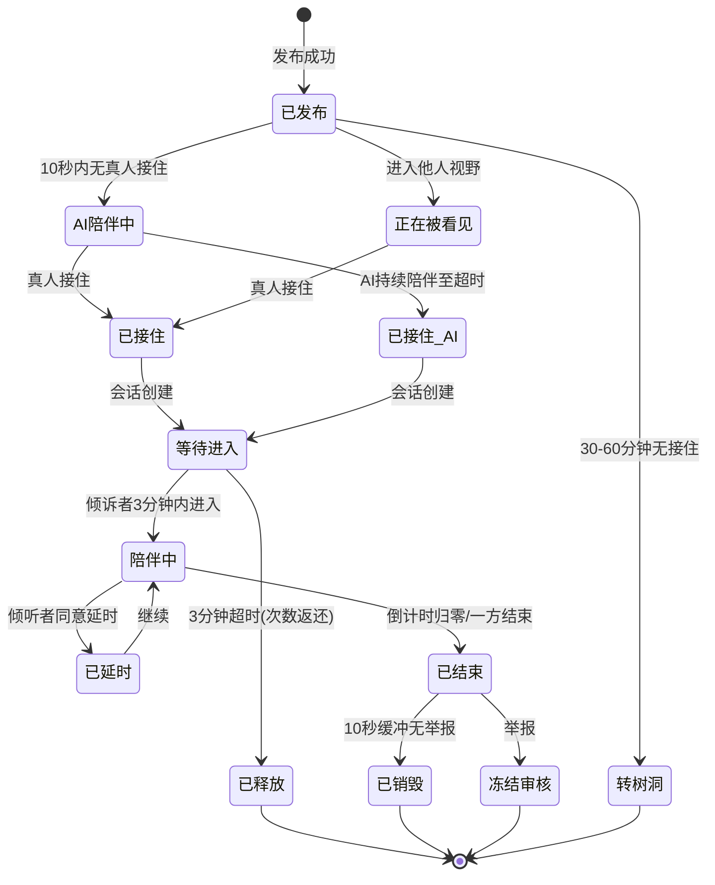
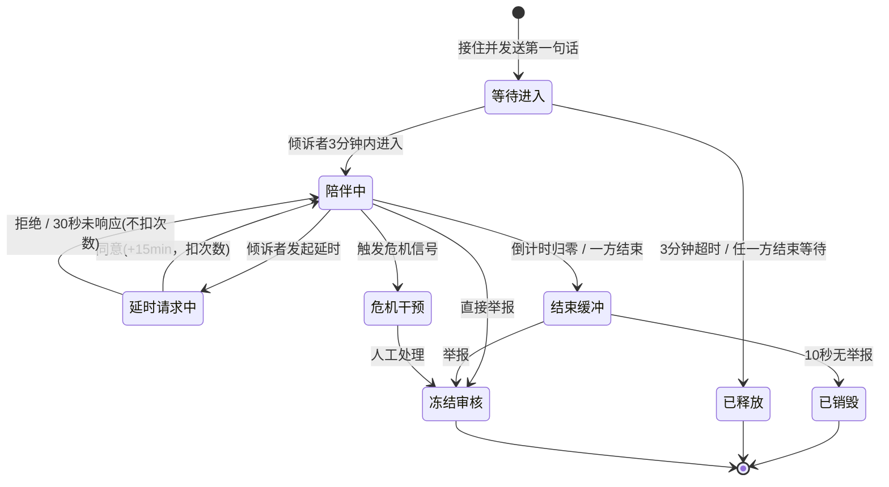
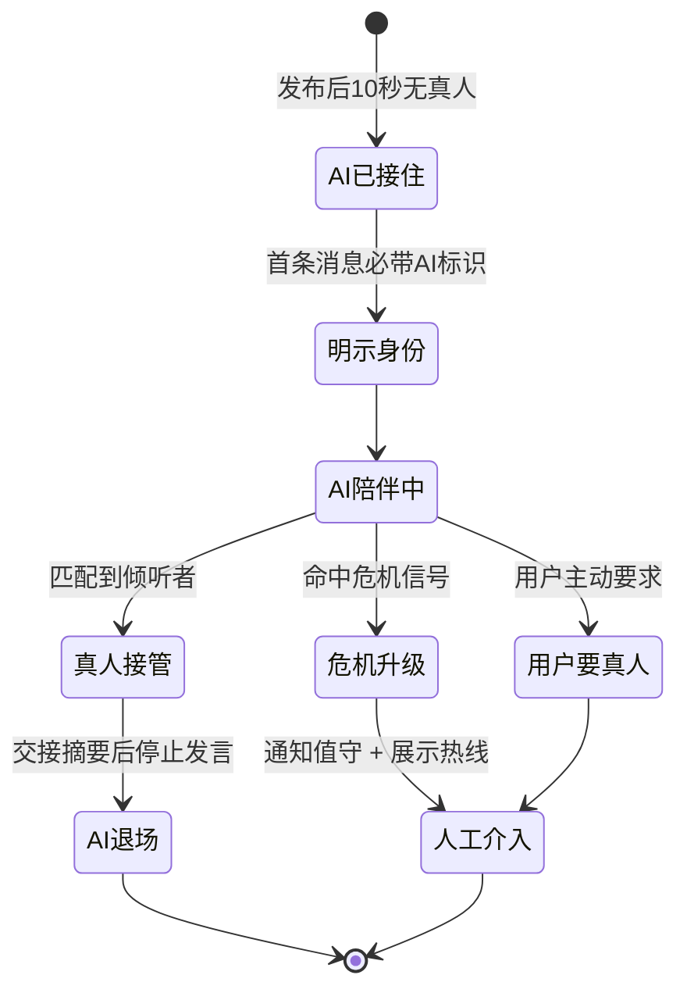
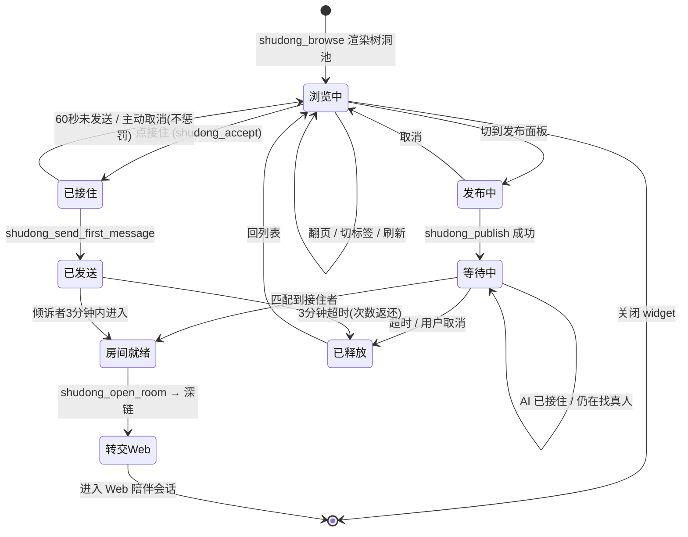

# 树洞泡泡 · Web + MCP 版

> 本文是《即时情绪接住网络（树洞池）v1.0》的修订版。
> 交付形态由「微信小程序」改为「**Web 主应用 + MCP 接入层**」，
> 并按讨论结论修正了原稿中自相矛盾或工程上不可行的部分。
>
> **原文件 `树洞泡泡.md` 保持不动，可对照查看。**

---

## 0. 修订摘要

| # | 变更项 | v1.0 原方案 | v2.0 修订 | 理由 |
|---|---|---|---|---|
| 1 | 交付平台 | 微信小程序 | **Web 优先（响应式 PWA）** | ① 匿名倾诉类目的资质要求可能直接卡死上架；② Web 才能完整拿到麦克风、系统推送、后台会话；③ 只有 Web 才能被 MCP App 深链跳转 |
| 2 | 接入形态 | 单一 App | **两个主体**：MCP 服务承载「找人 / 被找」，Web 承载「聊」。MCP 内分 界面(Widget) / 能力(Tools) / 交互(Elicitation) / 流程(Tasks) / 隐私(app-only) / 行为(Skills) | 分界线不是「实时」而是「找人·被找 vs 坐下来聊」；widget 对前者完全够用（见第二节） |
| 3 | 接住模型 | 纯真人接住 | **AI 先接住（明确自报身份）→ 真人升级** | 原稿 A01（1 分钟 ≥95%）与 A03（真人 >40%）自相矛盾，55%+ 用户无人接住且未定义兜底 |
| 4 | 语音方案 | 端侧变声 + 60s 原声录音 | **文字为主 + 服务端 TTS 合成语音** | 端侧变声在 Web 上成本高、情绪仍会外泄、且使 ASR 审核更难；合成语音没有原声、文本天然可审 |
| 5 | 树洞池呈现 | 泡泡上浮动画（Canvas 2D 60fps） | **MVP 列表优先，泡泡动画放 v2** | 动画工程成本高；原稿自己就要求「列表模式」（无障碍），列表本来就要做 |
| 6 | 状态权威 | 未明确 | **全部状态机服务端权威** | 限次与陪伴时长是核心风控，客户端计时可被绕过 |
| 7 | 技术选型 | K8s + Istio + Kong + Kafka + ES + InfluxDB | **大幅裁剪**（见第 5 节） | 单城市试点规模根本用不上，属于过早优化 |
| 8 | 敏感内容与 LLM | 未涉及 | **两级保险**：① 有 widget → app-only 工具绕过模型；② 无 widget → 跳 Web 输入 | `visibility:["app"]` 需要 widget 才有调用入口，因此必须有第 ② 级兜底（见 4.2） |
| 9 | 合规 | 泛泛提及 | **类目资质前置确认 + 留存规则明确化** | 原稿「聊完即焚」与「举报留存最后 20 条」表述矛盾 |
| 10 | 危机干预 | 关键词 + 人工 | **AI 语义初筛 + 规则兜底 + 人工必达** | 「100% 触发」是法律责任，纯关键词必然漏判 |
| 11 | **渲染确定性** | 未涉及 | **新增「确定性与渲染一致性」一节**；界面由服务端状态快照驱动 | 模型生成界面天然不确定；必须把非确定性挡在模型层与宿主层之外（见 6） |

---

## 一、PRD

### 1. 文档信息

| 项目 | 内容 |
|---|---|
| 产品名称 | 即时情绪接住网络（暂定名：树洞泡泡） |
| 文档版本 | **v2.0（Web + MCP 版）** |
| 文档状态 | 评审稿 |
| 目标平台 | **Web（响应式 PWA）为主入口；MCP 为接入面** |
| 目标用户 | 18 岁以上成年人 |
| 首发场景 | 单城市 / 单高校 / 单企业试点 |

### 2. 产品概述

#### 2.1 一句话定位

一个即时情绪接住网络：**发出信号，AI 立刻接住，真人随后接住**；1 分钟内一定有回应，聊完即散，无关系沉淀。

#### 2.2 产品背景

- 很多人有烦恼，但不想让熟人知道，找不到人倾诉。
- 传统心理咨询门槛高、费用高、预约难。
- 匿名社交容易变味，变成骚扰、约炮、诈骗。
- 现有倾诉平台多为接单模式，有供给方和需求方，关系可沉淀。
- **双边平台的死结**：冷启动期倾听者一定不够，纯真人匹配无法承诺「1 分钟被接住」。

#### 2.3 产品目标

1. 倾诉者 1 分钟内**一定**收到回应（AI 兜底保证），60 秒内尽量被真人看到。
2. 让倾听者可以随时在场、自愿接住、随时离开。
3. 聊完即散，无好友、无私信、无主页、无历史。
4. 高危问题转介专业渠道，不替代心理咨询。
5. 反成瘾，追求「被接住一次，然后回到生活」。

#### 2.4 非目标

- 不做匿名社交。
- 不做心理咨询平台。
- 不做接单 / 抢单 / 积分 / 排行榜。
- 不做实时语音房、不做实时音视频通话（MVP）。
- 不做好友、私信、主页、动态。
- 不做公开曝光、挂人、审判。
- **不做「AI 冒充真人」**（见 1.7 伦理护栏）。

### 3. 用户画像

（与原稿一致）

| 维度 | 倾诉者 | 倾听者 |
|---|---|---|
| 年龄 | 18—35 为主 | 18—40 为主 |
| 场景/特征 | 深夜、考试周、失恋、工作压力、家庭冲突、孤独 | 有安抚能力、愿意临时听别人说一会儿 |
| 痛点/动机 | 不想让熟人知道、不擅长文字、不想维护关系 | 被接住过、想帮助别人、获得意义感 |
| 需求 | 被看见、被听到、被接住、聊完即散 | 随时在场、自愿接住、随时离开、不被惩罚 |
| 顾虑 | 隐私泄露、被评价、被骚扰、没人理 | 被耗竭、被骚扰、被无限等待、被道德绑架 |

### 4. ★ 接住模型（核心修订）

原稿的验收标准自相矛盾：**A01 要求「1 分钟内被看到率 ≥95%」，A03 只要求「真人接住率 >40%」**。
那剩下的 55%+ 怎么办？原稿没有回答，只是说「30—60 分钟无人接住则转树洞」——
**让一个深夜崩溃的人等 30 分钟，是产品事故。**

修订为三段式接住：

```
用户发出信号
   │
   ├─ 0—10s  AI 第一接住（明确自报「我是 AI 助手」）
   │         目标：先让用户"被看见"、情绪落地、确认安全
   │
   ├─ 10s—60s  真人倾听者匹配（按标签 + 在线池）
   │         匹配到 → 双人临时房，AI 退场并交接上下文摘要
   │
   └─ 60s 仍未匹配到 → 保持 AI 陪伴 + 提示"正在为你找一位真人"
                       同时进入人工/志愿者队列
```

#### 4.1 伦理护栏（不可协商）

| 护栏 | 说明 |
|---|---|
| **AI 必须自报身份** | 开场必须明示「我是 AI 助手，不是真人」。不得使用拟人化话术误导 |
| AI 不得越界 | 不做诊断、不给医疗建议、不承诺保密范围之外的任何事 |
| AI 不得阻止求助 | 用户任何时候说「我要找真人」，必须立即转入真人队列并显示排队状态 |
| 交接要透明 | 真人接管时明确告知「现在由一位真人志愿者陪你」 |
| 危机必须升级 | 命中危机信号时 AI 不得自行"安抚了事"，必须触发人工 + 热线转介 |

> 情绪支持场景中，让用户误以为 AI 是真人会造成真实伤害，也有法律风险。
> 这条护栏的优先级高于任何留存或体验指标。

### 5. 功能需求

#### 5.1 功能清单（修订版）

| 编号 | 模块 | 功能 | 端 | 优先级 |
|---|---|---|---|---|
| F01 | 登录 | 手机号验证、年龄确认、社区公约 | Web | P0 |
| F02 | 布局 | 响应式布局（移动优先） | Web | P0 |
| F03 | 树洞池 | **列表模式**（标签筛选、时间排序） | Web | P0 |
| F04 | 树洞池 | 泡泡上浮动画 + 主视线光带 | Web | **P2（延后）** |
| F05 | 倾诉发布 | **文字为主** + 标签 + 模式选择 | Web | P0 |
| F06 | 语音 | **服务端 TTS 合成语音**（替代端侧变声） | Web | P1 |
| F07 | 接住（AI） | AI 第一接住，明确自报身份 | 服务端 | **P0（新增）** |
| F08 | 接住（真人） | 正在接 / 已接住两状态 | Web | P0 |
| F09 | 等待窗口 | 3 分钟等待倾诉者进入 | Web + 服务端 | P0 |
| F10 | 消息列表 | 倾听 TA 人 / 倾诉自我 两分组 | Web | P0 |
| F11 | 聊天页 | 文字 + 合成语音条、倒计时、结束陪伴 | Web | P0 |
| F12 | 延时 | 倾诉者发起、倾听者同意、3 次 × 15 分钟 | Web + 服务端 | P0 |
| F13 | 结束缓冲 | 10 秒缓冲期、举报保护 | Web | P0 |
| F14 | 举报 | 浮窗 / 聊天页 / 缓冲期均可举报 | Web + 服务端 | P0 |
| F15 | 危机干预 | AI 语义初筛 + 规则兜底 + 人工必达 + 热线转介 | 服务端 | P0 |
| F16 | 设置 | 隐身、勿扰、屏蔽标签、隐私、黑名单 | Web | P1 |
| F17 | 我的 | 我的泡泡、状态时间线、举报记录 | Web | P1 |
| F18 | 情绪评分 | 结束后情绪评分、安全评价 | Web | P1 |
| F19 | 限次 | 倾诉 3 次/日、倾听 5 次/日（服务端权威） | 服务端 | P0 |
| F20 | **MCP：树洞池浏览** | agent 内渲染树洞池（列表 / 分页 / 标签） | MCP Widget | **P1（新增）** |
| F21 | **MCP：发布面板** | agent 内发布泡泡（app-only，内容不过 LLM） | MCP Widget | **P1（新增）** |
| F22 | **MCP：接住流程** | agent 内接住 + 输入第一句话（app-only） | MCP Widget | **P1（新增）** |
| F23 | **MCP：状态卡片** | agent 内展示我的泡泡状态 + 深链进入 | MCP Widget | **P1（新增）** |
| F24 | **MCP：危机资源** | agent 内可直接取到热线与求助资源（最通用，优先做） | MCP Tools | **P1（新增）** |
| F25 | **MCP：流程与行为** | Tasks 承载「等待被接住」；Skills 固化伦理护栏 | MCP | **P1（新增）** |
| F26 | **深链免登** | 一次性 token 从 agent 跳入 Web 并免登 | Web + MCP | **P1（新增）** |
| F27 | **降级路径** | 宿主不支持 widget 时，工具返回文本列表 + 深链 | MCP Tools | **P1（新增）** |

#### 5.2 核心流程

**倾诉者 · Web 入口**

```text
登录 → 树洞池列表 → 点倾诉 → 写文字（可选加标签）→ 选模式
→ 发布 → 列表出现我的泡泡（带状态层）
→ 【0—10s】AI 第一接住（明确告知是 AI）
→ 【10—60s】真人接住 → 进入临时房
→ 聊天 → 延时（可选）→ 结束缓冲 → 房间销毁 → 回树洞池
```

**倾诉者 · MCP 入口（在 AI 助手里）**

```text
用户对助手说「我想找个地方说说」
→ 助手调用 shudong_open_publish → 渲染发布面板 widget
→ 用户在面板内输入内容（app-only 工具，不过 LLM）
→ 发布 → 面板显示状态：AI 已接住（明确标识）/ 等待真人
→ 需要实时陪伴 → 一次性深链 → 跳转 Web 应用（免登）
```

**倾听者 · MCP 入口（在 AI 助手里）**

```text
用户对助手说「我想听人说话」
→ 助手调用 shudong_browse → 渲染树洞池 widget
→ 浏览列表 → 点开一条 → 点「接住」
→ 输入第一句话（app-only 工具，不过 LLM）→ 发送
→ 等待倾诉者进入（3 分钟）
→ 面板显示「对方已进入」→ 一次性深链 → 跳转 Web 应用 → 实时聊天
```

**Web 入口（兜底，倾听者 / 倾诉者通用）**

```text
登录 → 树洞池列表 → 点开一条 → 读内容
→ 点接住 → 输入第一句话 → 发送 → 等待倾诉者进入（3 分钟）
→ 进入临时房 → 聊天 → 延时请求（可选）→ 结束 → 回树洞池
```

> **两条 MCP 入口是主路径**（降低倾听者摩擦），Web 入口是不支持 widget 的宿主上的兜底。
> 详细流程见 第二节 5.2 / 5.3。

> 原稿「必须听完 95% 才能接住」的门槛移到 P2：MVP 阶段内容很短（文字），
> 强制听完的防滥用收益低于它对倾听者转化率的伤害。MVP 改为「停留 ≥10 秒」即可接住。

### 6. 非功能需求

| 类别 | 需求 | 修订说明 |
|---|---|---|
| 性能 | 首屏 < 1.5s，消息延迟 < 500ms | 原「首页 60fps 泡泡动画」随动画一并延后 |
| 可用性 | 99.9%；**危机干预路径 100% 可达** | 危机路径与主链路解耦，主链路故障不得阻断危机告警 |
| 安全 | 后台实名、前台匿名、传输与存储加密 | **去掉「端侧变声/原声不出设备」**——改用 TTS 后根本没有原声 |
| 合规 | 备案、实名、内容审核、隐私政策、未成年人保护 | 增加**类目资质前置确认**（见第 6 节） |
| 隐私 | 聊完即散、无好友、无历史；**留存规则显式化** | 见 8.2 |
| 反成瘾 | 每日限次、不追求停留时长、到时间提示休息 | 与原稿一致 |

### 7. 数据模型

| 实体 | 关键字段 | 变更 |
|---|---|---|
| User | id, 手机号hash, 年龄确认, 状态, 封禁标记 | — |
| AnonymousSession | id, user_id, 临时匿名ID, 过期时间 | 匿名 ID 定期轮换 |
| Signal | id, user_id, 类型, 标签, 模式, **文本内容**, 状态, 创建时间 | **去掉「变声音频」，改为「TTS 音频（可选）」** |
| ListenerPresence | id, user_id, 在线状态, 愿意听的标签 | — |
| TempRoom | id, signal_id, 倾诉者ID, 倾听者ID, **接住方式(AI/真人)**, 开始时间, 结束时间, 状态 | **新增接住方式** |
| Message | id, room_id, 发送者, 类型, 内容/音频, 时间 | — |
| DelayRequest | id, room_id, 发起者, 状态, 创建时间 | — |
| Report | id, 举报人, 被举报人, 房间ID, 原因, 状态 | — |
| CrisisEvent | id, user_id, 信号/房间ID, **触发来源(语义/规则/人工)**, 处理状态 | **新增触发来源** |
| **McpLink** | id, user_id, token_hash, 过期时间, 已用标记 | **新增：一次性深链令牌** |

### 8. 数据保留与隐私（修正原稿矛盾）

原稿同时写「消息记录：房间结束即删」和「举报证据：最后 20 条消息 / 5 分钟音频，合规留存」——
这两条在**没有触发举报**时是矛盾的。修订为显式规则：

#### 8.1 分层保留

| 数据 | 保留策略 | 依据 |
|---|---|---|
| 原声 | **不存在**（改用 TTS，没有原声） | 设计即消除 |
| 倾诉文本 | 房间结束 **立即物理删除** | 产品承诺 |
| 房间消息 | 房间结束 **立即物理删除** | 产品承诺 |
| 危机事件记录 | **合规留存**（脱敏，不含原文） | 法律义务 |
| 举报证据 | **仅当触发举报时**，冻结并留存该房间最后 20 条消息 | 合规 + 举证 |
| 审核日志 | 合规留存，用户不可见 | 合规 |

#### 8.2 必须对用户透明

在隐私政策与首次使用弹窗中明确写清：

> 正常情况下，你们的对话在房间结束后**立即永久删除**，我们不留任何副本。
> **唯一例外**：如果对话中有人点击举报，或系统判定存在自伤/伤人风险，
> 我们会保存该次对话的最后 20 条消息用于安全审核与法律要求。

**不能只说「聊完即焚」而不说例外**——这会在真实案件中被认定为欺骗用户。

### 9. 验收标准（修订）

| 编号 | 验收项 | v1.0 | v2.0 修订 |
|---|---|---|---|
| A01 | 1 分钟被看到率 | ≥ 95% | ≥ 95%（**由 AI 保证**，不再依赖真人供给） |
| A02 | 首次响应中位数 | < 30s | **< 10s**（AI 第一接住） |
| A03 | 真人接住率 | > 40% | > 40%（试点），**并新增**：60s 内未匹配到真人时用户可见「正在找真人」状态 |
| A04 | 临时房完成率 | > 60% | > 60% |
| A05 | 倾诉后情绪改善 | > 30% | > 30% |
| A06 | 举报率 | < 1% | < 1% |
| A07 | 危机转介触发率 | 100% | 100%（**人工复核 + 可达性监控**，不只看关键词命中） |
| A08 | 3 分钟等待超时率 | < 20% | < 20% |
| A09 | 倾听者耗竭率 | < 10% | < 10% |
| **A10** | **AI 身份告知率** | — | **100%**（新增，伦理护栏） |
| **A11** | **MCP 入口发布转化率** | — | 新增观测项，用于判断该入口是否值得继续投入 |
| **A12** | **界面渲染确定性** | — | **同一状态快照 → 同一界面**（新增，见 6；用快照测试锁住） |

---

## 二、形态：MCP 内「找人 / 被找」+ Web 内「聊」

### 1. 总览

整套形态由**两个主体**组成，各自承载不同的交互：

```text
┌──────────────────────────────────────────────────────────────┐
│  Web 主应用 —— 你自己做 host（承载一切需要完整控制权的部分）     │
│    · 实时陪伴会话（AI / 真人）   · 倒计时 / 后台保持            │
│    · 系统推送通知               · 麦克风 / TTS 播放            │
│    · 举报 · 危机干预 · 我的 · 设置                             │
│    唯一能同时保证「完全可控」与「跨端一致」的地方               │
│    → 承载「聊」                                                │
└──────────────────────────────────────────────────────────────┘
          ▲                                          ▲
          │ 深链免登（一次性 token）                   │ 同源 API
          │                                          │
┌─────────┴────────────────────────────────────────────────────┐
│  MCP 服务 —— agent 内的入口，承载「找人 / 被找」                │
│                                                              │
│    L1 界面层  Widget            树洞池 · 发布 · 接住           │
│    L2 能力层  Tools             浏览 / 发布 / 接住 / 危机资源   │
│    L3 交互层  Elicitation       宿主代问，零前端代码           │
│    L4 流程层  Tasks             「等待被接住」这类长时流程      │
│    L5 隐私层  app-only 工具     敏感内容绕过 LLM 上下文         │
│    L6 行为层  Skills            把伦理护栏写进 agent 行为      │
└──────────────────────────────────────────────────────────────┘

  分工：MCP 内做「找人 / 被找」，Web 内做「聊」。
  无 widget 的宿主 → 降级为文本列表 + 深链，功能不失效。
```

**核心分工原则**：

> **能力用 Tools 暴露，流程用 Tasks 承载，敏感内容不进 MCP（留在自己的应用里输入），
> 而需要完整控制权的部分留在你自己的 host 里。**

### 2. 嵌入方式：六种选择与取舍

把应用「嵌进 agent」不止是嵌界面。实际上有六种不同层次的嵌入：

| 嵌入什么 | 机制 | 要写前端吗 | 采用度 | 树洞泡泡用不用 |
|---|---|---|---|---|
| **能力** | Tools | 否 | 全宿主通用 | ✅ 主路径 |
| **数据** | `structuredContent` / resource link / 媒体 mime | 否 | 广 | ✅ 状态与资源返回 |
| **交互** | Elicitation（宿主代问） | 否 | 广 | ✅ 确认与短输入 |
| **流程** | **Tasks** | 否 | 较新（未进官方支持矩阵） | ✅ **等待接住流程** |
| **行为** | **Skills** | 否 | 部分宿主 | ✅ 伦理护栏 |
| **界面** | MCP Apps widget | 是 | 不均 | ✅ **agent 内主入口：找人 / 被找** |
| **载体（反转）** | 你的应用做 host | 是（但在自己家） | — | ✅ **Web 主应用：承载对话** |

**分界线不是「实时 / 非实时」，而是「找人·被找」还是「坐下来聊」**：

| 交互 | 特征 | 放在哪里 |
|---|---|---|
| 浏览树洞池 · 发布倾诉 · 接住某人 · 查看状态 | 有界、用户主动触发、**不需要服务端推送** | ✅ **agent 内（widget）** |
| 实时陪伴会话 | 双向流、**需要服务端推送**、长时会话 | ❌ **必须 Web** |

#### 2.1 widget 适合「找人 / 被找」，不适合「聊」

需要修正一个**过度推广**：最初从「陪伴会话不能在 widget 里」这个正确结论，
错误地推出了「widget 只是可选增强」。实际上两类交互面对同样的规范约束，结论截然不同：

| 规范约束 | 对「陪伴会话」 | 对「浏览 + 接住」 |
|---|---|---|
| **不支持服务端主动推送** | ❌ 致命 | ✅ **不需要**——都是用户主动操作 |
| **回调限 60 次/分钟** | ❌ 远不够 | ✅ **绰绰有余**——点击才触发 |
| **iframe 生命周期短** | ❌ 聊到一半会没 | ✅ **可接受**——本来就是短会话 |
| **只允许 3 个方法** | ❌ 不够 | ✅ `tools/call` 够用 |
| 64 KiB / 200–720px | ❌ 聊天长列表放不下 | ⚠️ **分页即可** |

**所以 widget 是本产品在 agent 内的主入口，而实时陪伴必须跳到 Web。**

> 产品意义：倾听者的摩擦从「必须打开 Web 并登录」降到「对助手说一句就出现树洞池」。
> 这对本产品最大的瓶颈 —— **倾听者供给** —— 是实质性改善。

### 3. 为什么「陪伴会话」仍不能放进 agent

MCP Apps（[SEP-1865](https://modelcontextprotocol.org/seps/1865-mcp-apps-interactive-user-interfaces-for-mcp)，状态 Final）的规范限制决定了这一点：

| 规范限制 | 对陪伴会话的影响 |
|---|---|
| **不支持服务端主动推送** | 规范原文：*"It doesn't support a server pushing new widget state without a corresponding call"*。**「对方发来消息」推不进任何 agent 内界面** |
| **widget 回调限 60 次/分钟** | 约 1 次/秒，够轮询状态，**远不够承载消息流** |
| **只允许 3 个方法** | 仅 `resources/read` / `tools/call` / `ui/message`；`notifications/*`、`sampling/*` 一律被拒 |
| **iframe 生命周期不可控** | 10 秒内未完成 `ui:initialize` 即被替换为错误卡片；对话切走即消失 |
| 内联体积上限 64 KiB、尺寸 200–720px × ≤640px | 聊天长列表、大尺寸界面都不合适 |

**但要分清**：这些限制**只否定了「聊」**，没有否定「找人 / 被找」。
这正是能力 / 流程 / 界面 与 承载 之间的分界线。

#### 3.1 树洞泡泡的边界（修正版）

| 能力 | 放在哪里 | 用什么 |
|---|---|---|
| 浏览树洞池 | **agent 内** | Widget + `shudong_browse` |
| 发布倾诉 | **agent 内** | Widget + **app-only 工具**（内容不进 LLM） |
| 接住某人 + 输入第一句话 | **agent 内** | Widget + **app-only 工具** |
| 等待被接住 → 匹配成功 | **agent 内** | Tasks（见 4.4） |
| 危机热线资源 | **agent 内** | Tools（最通用，优先做） |
| 行为与话术约束 | **agent 内** | Skills |
| **实时陪伴会话** | **Web 主应用** | **唯一选择，必须跳出** |
| 被接住提醒（倾诉者侧） | Web / Tasks | 系统推送更可靠 |
| 倒计时、举报、录音 | Web 主应用 | 必须跳出 |

### 4. MCP 服务契约

MCP 服务对外做三件事：**暴露能力**（Tools）、**承载流程**（Tasks）、**渲染界面**（Widget）。

#### 4.1 能力层：工具集

工具分两类：**agent 可调的**（`visibility:["model"]`）与**只允许 widget 调用的**（`visibility:["app"]`，敏感内容不进 LLM）。

| 工具 | visibility | 参数 | 返回 | 说明 |
|---|---|---|---|---|
| `shudong_browse` | `["model"]` | `tags?`, `cursor?` | 列表（分页） | **渲染树洞池**（见 5.2） |
| `shudong_get_my_signals` | `["model"]` | — | `[{ signalId, status, listenerCount, caughtBy }]` | 仅状态聚合，**不含任何原文** |
| `shudong_get_support_resources` | `["model"]` | `region?` | `[{ name, phone, url, hours }]` | 危机热线。**最通用、优先做** |
| `shudong_watch_signal` | `["model"]` | `signalId` | `CreateTaskResult` | 长时流程，见 4.4 |
| `shudong_publish` | **`["app"]`** | `content`, `tags`, `mode` | `{ signalId, expiresAt }` | **倾诉原文不进 LLM** |
| `shudong_accept` | **`["app"]`** | `signalId` | `{ roomId, expiresAt }` | 接住，返回房间句柄 |
| `shudong_send_first_message` | **`["app"]`** | `roomId`, `text` | `{ ok }` | **第一句话不进 LLM** |
| `shudong_open_room` | **`["app"]`** | `roomId` | `{ url, expiresAt }` | 生成进房深链（一次性 token） |
| `shudong_open_publish` | `["model"]` | `tags?`, `mode?` | `{ url, expiresAt }` | **无 widget 宿主**的降级入口 |

> **降级原则**：`shudong_open_publish` 与 `shudong_browse` 的文本返回，保证在
> **不支持 widget 的宿主上功能依然可用**（用户被引导到 Web 完成同样的事）。

#### 4.2 隐私：敏感内容不进 LLM

| 内容类型 | 路径 | 是否进入 LLM 上下文 |
|---|---|---|
| **倾诉原文** | widget 内输入 → `shudong_publish`（`["app"]`） | ❌ **不进** |
| **接住后的第一句话** | widget 内输入 → `shudong_send_first_message`（`["app"]`） | ❌ **不进** |
| 泡泡状态 | Tool 返回聚合字段 | ✅ 非敏感，可进 |
| 危机资源（热线） | Tool 返回公开信息 | ✅ 可进 |
| 标签 / 模式选择 | 工具参数或 Elicitation | ✅ 非敏感，可进 |
| **无 widget 时的倾诉原文** | 跳 Web 应用内输入 | ❌ 完全不经过 MCP |

> **两级保险**：
> ① **有 widget** → 用 `visibility:["app"]` 的 app-only 工具，内容直达服务端，**绕过模型**；
> ② **无 widget**（或用户不愿在 agent 内输入）→ **跳回自己的 Web 应用输入**，根本不经过 MCP。
>
> ⚠️ 注意 `visibility:["app"]` 里的 "app" 指的就是**被渲染出来的 widget** ——
> 没有 widget 时这条旁路没有调用入口，此时**只能靠第 ② 级**。

#### 4.3 交互层：Elicitation（宿主代问）

服务端声明需要哪些字段，**宿主用它自己的原生 UI 收集**，零前端代码。

适用：**短的、结构化的、非敏感的**输入与确认。例如：

- 「选择标签」—— enum schema，单选
- 「发布前确认」—— 布尔确认
- 「是否继续等待真人」—— 二选一

**不适用**：倾诉原文。Elicitation 的应答会回到服务端（并且通常呈现在对话里），
不要把敏感内容放进 elicitation —— 那等于绕了一圈还是进了对话。

#### 4.4 ★ 流程层：Tasks（关键）

「等待被接住」天然是一个长时任务：可能等 10 秒，也可能等几分钟。
**用 Tasks 承载它，整条流程就能在 agent 内闭环，用户不必盯着屏幕。**

```text
1. 用户发布成功（widget 内 `shudong_publish`，或深链进 Web 发布）→ 得到 signalId
2. agent 调 shudong_watch_signal(signalId) → 服务端返回 CreateTaskResult
     { taskId, status: "working", ttl, pollInterval }
3. 宿主轮询 tasks/get(taskId)（或订阅 notifications/tasks）：
     working         → "正在为你找一位真人…"（statusMessage 带已等待时长）
     input_required  → inputRequests 里带 elicitation：
                       "真人志愿者已就位，现在进入陪伴吗？"
                       客户端用 tasks/update 应答
     completed       → result: { roomId, companionType, entryUrl }
4. agent 把 entryUrl 交给用户 → 深链进入 Web 主应用 → 真正的陪伴开始
```

**为什么这是关键设计**：

| 特性 | 价值 |
|---|---|
| **服务端可主动推送** | `notifications/tasks` —— 宿主支持时无需轮询。**这正好补上了 MCP Apps「不支持服务端推送」的短板** |
| **持久句柄** | `taskId` 是 durable handle，宿主重启 / 断线后仍可继续（crash resilience） |
| **中途交互** | `input_required` + `tasks/update`，无需第二条连接或服务端主动发消息 |
| **服务端主导** | 服务端按请求决定是否建任务，客户端只需一次性声明扩展能力 |

> ⚠️ **采用度提醒**：Tasks 有完整规范（`ext-tasks`），但**尚未进入官方扩展支持矩阵**。
> 因此必须保留**轮询兜底**与**纯 Web 路径** —— 在不支持 Tasks 的宿主上，功能绝不能失效。

#### 4.5 行为层：Skills（把伦理护栏写进 agent）

Skills over MCP（`io.modelcontextprotocol/skills`）嵌入的不是界面，而是**行为指南**。
对树洞泡泡来说，这是伦理护栏最有效的落地方式 —— **比任何 UI 都重要**。

```markdown
---
name: shudong-emotional-support
description: 当用户表达强烈负面情绪、孤独、或自伤倾向时使用。
---

## 必须做
1. 先用一句话承认对方的感受，不要急着给建议
2. 出现自伤 / 自杀 / 暴力信号 → 立即调用 shudong_get_support_resources 并展示热线
3. 询问是否需要一个匿名的倾诉出口 → 调用 **shudong_browse**（倾听者）或 **shudong_open_publish**（倾诉者）
4. 明确说明：树洞泡泡的陪伴者可能是 AI 助手，也可能是真人志愿者
5. 用户说「我想听人说话 / 有谁需要帮忙吗」→ 调用 **shudong_browse**
6. 用户说「我想找个地方说说」→ 调用 **shudong_open_publish**

## 绝对禁止
- 不做心理诊断，不给医疗或用药建议
- 不承诺保密范围之外的事
- 不尝试自己"安抚了事"而不触发危机资源
- 不假装自己就是树洞泡泡的陪伴者
```

> **注意**：Skills 是**指引**，不是**强制** —— 模型仍可能不遵守。
> 所以危机资源这类关键路径必须**同时由 Tools 和 Web 应用兜底**，不能只依赖 Skill。

### 5. agent 内主入口：Widget 承载「找人 / 被找」

> **这是倾听者与倾诉者在 agent 内的主要入口**，不是锦上添花。
> 实时陪伴会话仍然必须跳到 Web（见第 3 节的论证）。

#### 5.1 它买到了什么

| 收益 | 代价 |
|---|---|
| 倾听者**不用打开 Web 登录**，一句话就能看到树洞池 | 要写并维护前端（一次投入，双端复用逻辑） |
| 可用 `visibility:["app"]` 让敏感内容绕过 LLM | 需处理 iframe 沙箱、CSP、宿主主题与尺寸适配 |
| 视觉可控，能做出真正的「主页」 | 宿主支持度不均；生命周期不可控 |

**权衡结论**：这是**降低倾听者摩擦的核心手段** —— 而倾听者供给正是本产品最大的瓶颈。
因此它是主路径，需要认真投入；同时保留 Web 入口作为全覆盖兜底。

#### 5.2 倾听者流程

```text
用户在 agent 里说「我想听人说话 / 有谁需要帮忙吗」
  → agent 调 shudong_browse(tags?)  → 渲染出树洞池
  → 列表（分页，每页 10 条）：🏷 标签 · ⏱ 时间 · 内容摘要 · N 人在听
  → 点开一条 → 显示全文
  → 点「接住」→ tools/call: shudong_accept(signalId)
       ← { roomId, acceptExpiresAt }
  → 输入框「说点什么，让 TA 知道你在」
  → tools/call: shudong_send_first_message(roomId, text)   ← app-only，不进 LLM
  → 等待倾诉者进入（轮询 / Tasks）
        · 倾诉者进入 → widget 显示「对方已进入」+ [开始陪伴]
            → shudong_open_room → ui/open-link → Web 应用 → 实时聊天
        · 3 分钟超时 → 次数返还，回列表
```

#### 5.3 倾诉者流程

```text
用户说「我想找个地方说说」
  → agent 调 shudong_open_publish / 渲染发布面板
  → 填标签 + 模式 + 内容
  → tools/call: shudong_publish(content, tags, mode)   ← app-only，不进 LLM
  → 显示状态：AI 已接住（明确标识）/ 等待真人
  → 需要实时陪伴 → shudong_open_room → 深链跳 Web
```

#### 5.4 Widget 界面草图

```text
倾听者视角                          倾诉者视角
┌───────────────────────────┐      ┌───────────────────────────┐
│  🫧 树洞池      [刷新]      │      │  🫧 倾诉                    │
│  [全部][学业][孤独][焦虑]   │      │                           │
│  ─────────────────────     │      │  标签：[学业][关系][孤独]   │
│  🫧 孤独 · 2 分钟前         │      │  模式：○ 只想被听到         │
│     深夜了，还是睡不着…     │      │        ○ 希望有人接住       │
│     3 人在听    [接住]      │      │  ┌─────────────────────┐  │
│  ─────────────────────     │      │  │ 想说什么都可以…      │  │
│  🫧 焦虑 · 5 分钟前         │      │  └─────────────────────┘  │
│     明天要面试，心跳得厉害…  │      │            [ 发布 ]       │
│     1 人在听    [接住]      │      │                           │
│  ─────────────────────     │      │  发布后 1 分钟内一定有回应  │
│  [ 加载更多 ]               │      │  陪伴者可能是 AI，也可能是  │
│                            │      │  真人志愿者                │
│ 需要帮助？[热线 12356]      │      │ 需要帮助？[热线 12356]     │
└───────────────────────────┘      └───────────────────────────┘
```

#### 5.5 关键设计点

| 点 | 做法 |
|---|---|
| **分页** | 内联结果上限 64 KiB、内联高度 ≤640px → 每页 10 条，滚动加载走 `tools/call` |
| **限流** | 宿主约 60 次/分；浏览 + 翻页 + 接住都是**用户点击触发**，绰绰有余 |
| **深链跳出** | `ui/open-link` 只能开 `https://` 且宿主会弹确认框 —— **不要设计成必须点链接才能完成流程** |
| **危机资源常驻** | 任何界面下一键可取热线 |
| **资源内容寻址** | HTML 用版本化 URI（`ui://shudong/bubbles.html?v=3`），**不要每次动态生成** |
| **读宿主上下文** | 颜色/字体/圆角/语言/时区一律来自 host context，**不硬编码**（见 6） |
| **触发可靠性** | 是否调用 `shudong_browse` 由模型决定，**可能不调** → 靠 Skill 固化触发条件 + 保留 Web 入口兜底 |

#### 5.6 资源声明

```jsonc
// tools/list —— 声明 widget 的工具
{
  "name": "shudong_browse",
  "description": "打开树洞池，浏览正在等待被听见的人。",
  "inputSchema": {
    "type": "object",
    "properties": { "tags": { "type": "array", "items": { "type": "string" } } }
  },
  "_meta": {
    "ui": {
      "resourceUri": "ui://shudong/bubbles.html?v=3",
      "visibility": ["model", "app"]
    }
  }
}
```

```jsonc
// resources/read 的响应 —— 提供 HTML
{
  "contents": [{
    "uri": "ui://shudong/bubbles.html?v=3",
    "mimeType": "text/html;profile=mcp-app",
    "text": "<!doctype html>…",
    "_meta": {
      "ui": {
        // 只声明真正需要的域；宿主会做 CSP 校验
        "csp": { "connectDomains": ["https://shudong.example.com"] },
        // 注意：是对象映射，不是字符串数组
        // 播放 TTS 语音只用 <audio>，不需要 microphone 权限
        "permissions": { "clipboardWrite": {} }
      }
    }
  }]
}
```

#### 5.7 设计约束（照规范来，不要踩坑）

- HTML 必须**自包含**（内联脚本样式；外部资源用 `data:` URL 或走 `csp` 白名单）
- 宿主**不托管也不转换**你的静态资源
- 工具返回值必须**自给自足**：widget 渲染失败时，agent 仍要能据此回答（graceful degradation）
- **任何返回都不得回传倾诉原文**，否则原文会随 tool result 进 agent 上下文
- 声明为 `app`-only 的工具必须确认**只在 widget 内被调用**，无 widget 时不会被触发

#### 5.8 覆盖率与降级（必须做）

只有支持 MCP Apps 的宿主才能渲染 widget。因此：

| 情况 | 行为 |
|---|---|
| 宿主支持 widget | 渲染树洞池 / 发布面板，**主路径** |
| 宿主不支持 widget | 工具返回**结构化文本列表**（含摘要） + 深链，引导到 Web 完成同样的事 |
| 模型没调用 `shudong_browse` | 用户仍可通过 Web 入口进入；Skill 用于提高调用率 |

**双入口并存**：widget 为主（体验好），Web 为兜底（人人可用）。

### 6. ★ 确定性与渲染一致性

> **核心原则：确定性的关键不是「控制渲染」，而是「不让不该参与决策的层参与决策」。**

#### 6.1 渲染管道：六层里只有两层可控

```text
① 模型决定是否调用你的工具      ← 非确定（LLM 采样）
② 模型决定传什么参数            ← 非确定（LLM 采样）
③ 你返回数据 / 资源             ← ✅ 你 100% 可控
④ 宿主决定是否渲染 widget       ← 非确定（宿主能力、策略、版本）
⑤ 宿主用它的主题/尺寸渲染        ← 非确定（light/dark、字体、200–720px…）
⑥ 你的 HTML / 组件内部状态      ← ✅ 你 100% 可控
```

**做法：把非确定性挡在 ①②④⑤ 之外 —— 让这四层只能决定「要不要显示」，不能决定「长什么样」。**

#### 6.2 先选范式：确定性上限由此决定

| 范式 | 做法 | 确定性 |
|---|---|---|
| **生成式 UI** | 让模型生成 HTML / markdown / 布局 | ❌ **天然不确定**——同输入不同输出是必然 |
| **声明式 UI** | 模型只**选模板 + 填数据**，结构由 schema 固定 | ✅ 结构确定，样式随宿主 |
| **固定 UI** | 界面是你托管的 HTML，数据走 tool result | ✅✅ 完全确定（除宿主主题/尺寸） |

**产品结论：能用固定就别用声明式，能用声明式就绝不用生成式。**

> 如果出现「同一操作每次界面都不一样」，问题几乎一定不在渲染层，
> 而在于**让模型画了界面**。改成「模型选组件、你渲染组件」即可解决。

**树洞泡泡的选择：MCP widget 用「固定 UI」；Web 主应用本身就是固定 UI。**

#### 6.3 逐层对策

**①② 模型层（非确定）**

| 手段 | 说明 |
|---|---|
| 别让模型组装界面 | 模型只负责取数据，布局由我们的代码决定 |
| `visibility:["app"]` | 关键操作由 widget 直接调用，**绕过模型的调用决策**（⚠️ 需 widget 存在才生效；无 widget 时改用跳转 Web 的方案） |
| Elicitation / Tasks 驱动 | 由**服务端**发起交互，而不是等模型想起来调用 |
| 工具描述写死触发条件 | 有效但**不保证**——因此必须设计「没被调用也不出错」的路径 |
| Skills（`SKILL.md`） | 把「什么情况必须调用」固化为行为约束，作为语义兜底 |

**④ 宿主是否渲染（非确定）**

规范本身强制要求 **graceful degradation**：

> 工具有效返回必须**自给自足** —— widget 渲染不了时，agent 仍要能据此回答用户。

因此正确姿势是：**先把 widget 当增强、不当必需**。先交付 Tools + 文本 / `structuredContent` 的完整版本，
确认信息完整，再加 widget。这样「有没有渲染」不会造成信息不一致。

同时用 MCP 的 **capability 协商**（`extensions` 字段 + `server/discover`）先探测宿主能力，再决定走哪条路径。

**⑤ 宿主样式 / 尺寸（非确定）—— 「看起来不一致」的主因**

这里有一个必须先明确的取舍：

| 取向 | 可行性 | 做法 |
|---|---|---|
| **融入宿主**（推荐） | ✅ | 读宿主下发的 host context，让界面长得像宿主的一部分 |
| **像素级一致** | ❌ **做不到** | 除非放弃宿主渲染，跳回我们自己的应用 |

规范提供 host context 通道（以 Cowork 为例）：初始化时推送 theme / locale / time zone / text direction /
style variables，并通过 `ui/notifications/host-context-changed` 持续更新。**读它，别硬编码。**

- ❌ 不写死颜色、字体、圆角 —— 用宿主提供的 style variables
- ❌ 不假设尺寸 —— 内联区仅 200–720px 宽、≤640px 高，宿主按 `ui/notifications/size-changed` 调整
- ❌ 不写死文案语言 / 日期格式 —— 用 host locale
- ✅ 响应式 + 内容优先，而非固定像素稿

**③⑥ 我们自己的层（可控）—— 确定性的正解**

| 实践 | 要求 |
|---|---|
| **数据驱动 + 固定模板** | 同一份数据 → 同一个组件树；**禁止随机数、禁止用当前时间参与展示逻辑** |
| **资源内容寻址** | `ui://shudong/bubbles.html?v=3`，同一版本永远同一份 HTML，不动态生成 |
| **服务端渲染状态，客户端无状态** | 所有影响显示的字段都来自服务端快照 —— **重放同一快照 = 同一界面** |
| **确定性排序** | 列表/标签顺序显式排序（按时间或 id），**不依赖字典/哈希遍历顺序** |
| **时间收口** | 服务端下发**绝对 UTC 时间戳**（如 `deadlineUtc`）而非「剩余 22:14」字符串；格式化函数只有一份 |
| **幂等** | 同一请求重复调用结果一致（也是 Tasks / 重试的前提） |
| **版本固定** | widget HTML 版本化，用快照测试锁住渲染结果 |

#### 6.4 「一致」有四种含义，其中一种保证不了

| 你要的「一致」 | 能否保证 | 靠什么 |
|---|---|---|
| 同一会话内不跳变 | ✅ 能 | 服务端状态快照 + 稳定 key + 内容寻址资源 |
| 同一数据 → 同一界面（跨用户） | ✅ 能 | 数据驱动渲染 + 确定性排序 + 固定模板 |
| 同一输入多次调用可复现 | ✅ 能 | 幂等 + 版本化资源 + 快照测试 |
| **跨宿主长得一模一样** | ❌ **做不到** | 除非放弃宿主渲染，用我们自己的应用 |

> 这也正是为什么「实时陪伴会话」必须放在 Web 侧 —— 那里我们才有完整的渲染控制权。

#### 6.5 落到树洞泡泡

| 界面元素 | 确定性做法 |
|---|---|
| 泡泡状态卡 | 固定模板 + 服务端状态快照（`status` 枚举），**不生成、不拼接** |
| 倒计时 | 服务端下发 `deadlineUtc`，客户端用**固定的**格式函数 + host 时区渲染 |
| 倾诉输入框 | **Elicitation** 的 schema 固定 → 宿主渲染，天然一致 |
| 泡泡列表 | 服务端排好序 + 稳定 cursor |
| 危机热线卡 | 纯 tool 返回的固定结构，**不依赖 widget 渲染** |
| 色彩 / 字体 / 圆角 | 全部读 host context，**不硬编码** |

#### 6.6 验收与测试

| 项 | 做法 | 对应验收 |
|---|---|---|
| 渲染快照测试 | 固定状态快照 → 断言渲染结果（纳入 CI） | A12 |
| 契约测试 | 固定输入 → 断言输出结构，防字段漂移 | A12 |
| 降级测试 | 关闭 widget 渲染，验证信息仍完整可读 | ④ 层兜底 |
| 模型不调用测试 | 构造模型不调用工具的场景，验证用户仍有可用路径 | ①② 层兜底 |

### 7. 能力边界对照

| 能力 | **MCP Widget（agent 内主入口）** | MCP 服务（Tools + Tasks，无 UI） | Web 主应用 |
|---|---|---|---|
| **浏览树洞池** | ✅ **主入口** | ✅ 文本列表（降级） | ✅ 兜底 |
| **发布倾诉** | ✅ **主入口**（app-only，内容不进 LLM） | ➖ 返回深链，跳 Web 输入 | ✅ |
| **接住 + 第一句话** | ✅ **主入口**（app-only） | ➖ 返回深链 | ✅ |
| 等待被接住 → 匹配成功 | ⚠️ 轮询 / Tasks | ✅ **Tasks**（含 `input_required`） | ✅ 系统推送 |
| **实时陪伴会话** | ❌（无推送 + 限流 + 生命周期） | ❌ | ✅ **唯一** |
| 倒计时 / 后台保持 | ❌ | ➖ 由 Tasks 状态近似 | ✅ |
| TTS 语音播放 | ⚠️ `<audio>` 可行（无需麦克风权限） | ⚠️ `audio/*` 资源 | ✅ |
| 被接住提醒（倾诉者侧） | ⚠️ 需 Tasks 推送 | ⚠️ 同上 | ✅ 系统推送更可靠 |
| 危机热线资源 | ✅ | ✅ **最通用，优先做** | ✅ |
| 举报 / 危机干预 | ➖ 仅给热线资源 | ➖ 仅给热线资源 | ✅ |
| 深链免登 | ✅ `ui/open-link` | ✅ 由 Tool 返回 | ✅ 落地页 |
| **是否需要写前端** | 是（一次投入） | **否** | 是 |
| **宿主支持度** | 不均（**需降级**） | 全宿主通用（Tasks 除外） | — |

---

## 三、交互原型

### 1. Web 端（移动优先响应式）

```text
┌─────────────────────────────┐
│  树洞泡泡            💬 ②   │  顶部栏 56pt
├─────────────────────────────┤
│  [全部][学业][关系][孤独]…  │  标签筛选（横向滚动）
├─────────────────────────────┤
│  🫧 孤独 · 2 分钟前          │  列表项
│     深夜了，还是睡不着…      │
│     3 人在听                 │
├─────────────────────────────┤
│  🫧 焦虑 · 5 分钟前          │
│     明天要面试，心跳得厉害…   │
│     1 人在听                 │
├─────────────────────────────┤
│                             │
│         ( 倾诉 )            │  中央凸起按钮
├─────────────────────────────┤
│  ⌂ 树洞池   ◉ 倾诉   ○ 我的  │  底部栏 64pt
└─────────────────────────────┘
```

> 原稿的「泡泡上浮 + 主视线光带 + 每泡泡记一次曝光」整体移到 **v2**。
> 曝光统计在列表模式下改为「进入可视区 ≥1s 记一次曝光」，语义等价、实现成本极低。

### 2. 发布面板（Web）

```text
┌─────────────────────────────┐
│  倾诉                    ×  │
├─────────────────────────────┤
│  ┌───────────────────────┐  │
│  │ 想说什么都可以…        │  │  文字输入（主路径）
│  │                       │  │
│  └───────────────────────┘  │
│                             │
│  标签：[学业][关系][孤独]    │
│        [焦虑][家庭][其他]    │
│                             │
│  模式：○ 只想被听到          │
│        ○ 希望有人接住        │
│                             │
│  ☐ 用语音朗读我的文字        │  服务端 TTS（P1）
│                             │
│  [ 发布 ]                    │
│                             │
│  提示：发布后 1 分钟内一定会 │
│  有回应。陪伴你的可能是 AI   │
│  助手，也可能是真人志愿者。   │  ← 伦理告知前置
└─────────────────────────────┘
```

### 3. 聊天页（Web）— 标注接住方式

```text
┌─────────────────────────────┐
│  ←  临时陪伴                │
├─────────────────────────────┤
│  剩 22:14                   │
│  🟢 AI 助手陪伴中            │  ← 明确标识
│  （真人志愿者正在赶来…）      │
│  ─────────────────────────  │
│  [AI] 我在听。愿意多说一点吗？│
│  [我] 谢谢…                 │
│  ─────────────────────────  │
│  🟢 现在由真人志愿者陪你      │  ← 交接明示
│  [对方] 你好，我在听。       │
│  ─────────────────────────  │
│  [延时 15 分钟]  剩余：2/3   │
│  [输入框]            [发送]  │
│  [结束陪伴]                  │
├─────────────────────────────┤
│  ⌂ 树洞池   ◉ 倾诉   ○ 我的  │
└─────────────────────────────┘
```

### 4. 其他页面

原稿的**等待进入页、延时提醒、结束缓冲期、举报表单、设置页、我的页、危机干预页**
交互与文案保持不变，仅做两处调整：

- **危机干预页**：增加「一键转人工」按钮与当前排队状态显示
- **设置页**：删除「屏蔽标签」以外的音频相关项（不再有变声设置），增加「AI 陪伴开关」（默认开）

---

## 四、状态机（全部服务端权威）

> **所有状态、倒计时、次数均由服务端裁决**，客户端只做展示。
> 限次与陪伴时长是核心风控，客户端计时可被改本地时间绕过。

### 1. 泡泡状态机



### 2. 临时房状态机



### 3. AI 接住状态机（新增）



> **`明示身份` 是不可跳过的状态**：任何路径进入 AI 陪伴，首条消息必须包含 AI 身份标识。
> 验收项 A10 对此做 100% 校验。

### 4 & 5. 用户角色、延时、举报状态机

保持原稿不变（用户角色：空闲 / 倾听中 / 倾诉中 / 两者兼有；延时：3 次 × 15 分钟，倾听者同意才生效；举报：提交即冻结房间）。

### 6. Widget 会话生命周期（新增）

这是 agent 内「找人 / 被找」的主流程。**同样服务端权威**，widget 只是视图。



**与 Web 的分界点**：`房间就绪 → 转交Web`。
这一刻之前都在 agent 内完成，之后必须跳到 Web —— 因为接下来是实时双向流。

> Widget 生命周期短（对话切走即消失）**不影响正确性**：
> 所有状态都在服务端，用户重新打开 widget 时按 `signalId` / `roomId` 恢复视图即可。

---

## 五、技术选型（裁剪版）

原稿的清单接近「大厂微服务」配置，对单城市试点属于**过早优化**。逐条裁剪：

### 1. 保留

| 类别 | 选型 | 理由 |
|---|---|---|
| 前端 | **React / Vue + Vite**，移动优先响应式 | Web 主应用；取代小程序 |
| 实时通信 | **WebSocket**（不建议硬套 SignalR 协议） | 简单 JSON 信封，前端与 widget 都好接 |
| 关系型数据库 | **PostgreSQL** | 用户、房间、举报、延时 |
| 缓存 | **Redis** | 在线池、房间倒计时、会话状态、限次计数 —— 真正的热点 |
| 对象存储 | COS / OSS | TTS 音频临时存放，**设短生命周期策略** |
| 推送 | **Web Push（VAPID）** + 可选短信兜底 | 「有人接住你了」必须送达 |
| 实名 | 手机号 + 运营商三要素 | 后台实名 |
| AI | LLM provider（用于 AI 接住 + 危机语义初筛） | 见下 |

### 2. 裁掉（并说明什么时候再加）

| 原选型 | 处理 | 重新评估的时机 |
|---|---|---|
| Kong / APISIX 网关 | ❌ 去掉 | 多服务、多租户时 |
| Kafka / RabbitMQ | ❌ 起步用进程内队列 | 有异步审核/推送积压时 |
| Kubernetes + Istio | ❌ 单机 Docker Compose | DAU > 5 万或需要多活时 |
| Elasticsearch | ❌ 先用 PostgreSQL 全文检索 | 举报检索成为瓶颈时 |
| InfluxDB | ❌ 先用 Prometheus | 指标维度爆炸时 |
| 服务网格 | ❌ | 微服务数 > 10 时 |
| Jaeger / SkyWalking | ⏸ 先用 OpenTelemetry + 日志 | 排障困难时 |

### 3. AI 与音频

| 类别 | 选型 | 说明 |
|---|---|---|
| AI 接住 | 通用 LLM + 专用系统提示 | **必须带身份标识**；不接医疗建议 |
| 危机识别 | **语义模型初筛 + 规则兜底 + 人工必达** | 纯关键词必然漏判，而 A07 要求 100% |
| 内容审核 | 云内容安全（文本）+ 人工复审 | 文本可审；TTS 音频是合成音，风险低 |
| TTS | 云 TTS | **替代端侧变声**：无原声、天然可审 |
| ASR | ❌ MVP 不需要 | 所有语音都是 TTS 合成，无用户原声需转写 |

### 4. 基础设施

单机 Docker Compose 起步：`web + api + worker + postgres + redis`。
试点规模估算：峰值 1000 在线 / 200 并发会话 → **单台 4C8G 足够**。

---

## 六、安全与合规

### 1. ⚠️ 第一优先级：类目资质前置确认

**这是唯一可能让整个项目归零的风险，必须在写代码之前确认。**

匿名倾诉 / 情绪陪伴类内容，在主流平台（小程序、应用商店）审核极严，
通常需要**心理咨询或社交类目资质**，且可能需要：
- 企业主体 + 相关经营范围
- 心理服务相关资质或合作机构背书
- 内容安全应急预案

**行动项**：在 Phase 0 就完成资质调研与主体准备。**不要写完代码才发现上不了架。**

### 2. 危机干预是法律责任

A07 要求「危机转介触发率 100%」，意味着漏判要担责。上线前必须具备：

| 项 | 要求 |
|---|---|
| 心理顾问 | 至少 1 名，参与话术、阈值、SOP 制定并签字 |
| 值守机制 | 危机事件 7×24 有人响应（至少电话可达） |
| 转介链路 | 12356 / 110 / 120 / 12355 一键可达，且**可达性被监控** |
| 记录留痕 | CrisisEvent 全流程留痕（脱敏） |
| 免责与协议 | 明确「不替代专业咨询」，但不作为免责挡箭牌 |

### 3. 隐私与匿名

| 项 | 措施 |
|---|---|
| 传输 | TLS |
| 存储 | 敏感字段加密；倾诉原文**不落盘**（仅内存 + Redis TTL） |
| 匿名 ID | 与实名 ID 分离，**定期轮换** |
| 双向匿名 | 双方互不可见身份；真人接管也不暴露 |
| 留存例外 | 见 8.2，且在隐私政策中显式说明 |

### 4. 未成年人保护

- 年龄确认（≥18），**不能只靠勾选**
- 检测到疑似未成年人 → 直接引导青少年服务（12355），不进普通池
- 青少年模式下禁用匿名倾诉池

### 5. MCP 特有安全项

| 项 | 措施 |
|---|---|
| 敏感内容不过 LLM | **主路径**：widget 内输入 → `visibility:["app"]` 的 app-only 工具直达服务端。**兜底**：无 widget 时跳 Web 输入。**上线前必须实测验证**（不同宿主实现可能有差异） |
| Widget 域白名单 | `csp.connectDomains` 只声明自己的域；清单 `validDomains[]` 必须列全，否则域会被剥离并给用户弹「网络被拦截」警告 |
| 深链令牌 | 一次性、短 TTL（建议 5 分钟）、绑定 user_id、用后即焚 |
| Widget 不可信输入 | widget 内渲染的数据按不可信输入处理（防 XSS）—— 倾述内容是**不可信用户输入** |
| Widget 内不得回传原文 | 任何 tool 返回都不得包含倾诉原文，否则会随 tool result 进 agent 上下文 |
| 降级路径 | widget 不渲染时功能必须仍可用（工具的文本返回要自给自足） |
| 限次仍在服务端 | widget 只是视图，限次 / 倒计时 / 状态一律服务端裁决，防止客户端绕过 |

---

## 七、实施路线

| 阶段 | 内容 | 交付 | 估时 |
|---|---|---|---|
| **0** | **资质调研 + 主体准备**；协议与数据模型定稿 | 合规结论、接口定义 | 1 周 |
| 1 | 后端骨架：房间状态机（服务端权威）、匹配/在线池(Redis)、WebSocket 端点、限次 | 可跑通的后端 | 2-3 周 |
| 2 | **AI 第一接住 + 危机语义初筛** | AI 接住链路 + 危机告警 | 1-2 周 |
| 3 | Web MVP：登录 → 列表式树洞池 → 文字发布 → 接住 → 临时房 → 结束 | 可用产品 | 3-4 周 |
| 4 | 安全合规：举报取证、人工审核后台、危机值守 SOP | 可上线 | 2 周 |
| 5 | **MCP 层**：Server 工具集 + **Widget（树洞池 / 发布 / 接住）** + Tasks + Skills + 深链免登；**同时落地快照/契约测试（A12）** | **agent 内主入口** | **3-4 周** |
| 6 | v2：泡泡动画、TTS 语音、情绪标签推荐 | 体验增强 | 按需 |

**顺序理由**：
- 阶段 0 的资质结论决定项目是否继续，必须最先做
- 阶段 2（AI 接住）先于阶段 3（Web MVP），因为它直接决定 A01/A02 能否达标
- **阶段 3（Web）先于阶段 5（MCP）**：Web 是兜底入口、且 widget 与 Web 共用同一套服务端契约与接口；
  先把后端与 Web 跑通，widget 才有稳定的 API 可对接
- **阶段 5 的工作量比原来预估的大**：widget 从「可选」变成「agent 内主入口」，
  需要真正实现树洞池 / 发布 / 接住三个界面，并处理分页、降级、宿主上下文适配
- 阶段 5 必须**同时**建立快照与契约测试：MCP 层的界面一致性只能靠测试锁住（见 6）

**与 Web 的复用关系**：
Widget 与 Web 主应用**共用同一套服务端接口与数据契约**，只是视图不同。
因此阶段 5 的增量主要是「视图层 + MCP 包装」，而不是重写业务逻辑。

---

## 八、风险登记册

| # | 风险 | 影响 | 应对 |
|---|---|---|---|
| R1 | **平台类目资质不通过** | 🔴 项目归零 | Phase 0 前置确认；准备企业主体与资质 |
| R2 | **危机干预漏判担责** | 🔴 法律 | 语义+规则+人工三层；心理顾问签字；值守 SOP |
| R3 | **AI 被误认为真人** | 🔴 伦理/法律 | 强制身份标识 + A10 100% 校验；话术禁止拟人化 |
| R4 | 倾听者供给不足 | 🟠 体验 | AI 先接住兜底；志愿者运营；高校/企业合作 |
| R5 | 匿名被滥用（骚扰/诈骗） | 🟠 安全 | 强风控、限次、举报、实名后台可追溯 |
| R6 | **MCP widget 实际能力与规范不符** | 🟡 功能 | 各宿主实现有差异；**先用 MCP Server（无 UI）验证，再加 widget** |
| R7 | MCP 宿主覆盖率低 | 🟡 增长 | 不作为唯一入口；Web 为主 |
| R8 | 倾诉内容泄露 | 🔴 信任 | 不落盘 + 加密 + 留存例外透明化 |
| R9 | 反成瘾目标与增长目标冲突 | 🟡 战略 | 明确不做时长指标；以「被接住一次」为成功 |
| R10 | **同一界面在不同宿主 / 不同版本下表现不一致，被误判为 bug** | 🟡 体验 | 明确「融入宿主」而非像素一致的预期；widget HTML 版本化 + 快照测试；关键信息不依赖 widget（见 6） |
| R11 | **模型未按预期调用工具，导致用户操作无效** | 🟠 功能 | Skill 固化触发条件；关键路径不依赖模型决策（Elicitation / Tasks 由服务端主动发起）；**保留纯 Web 路径兜底** |
| R12 | **宿主不支持 MCP Apps，widget 不渲染** | 🟠 覆盖 | **双入口并存**：widget 为主、Web 为兜底；工具返回结构化文本列表 + 深链，功能不失效（见 5.8） |

---

## 九、相对 v1.0 的完整变更清单

| 章节 | 变更 |
|---|---|
| 定位 | 增加「AI 立刻接住，真人随后接住」 |
| 目标 | 增加「1 分钟内**一定**收到回应」（不再依赖真人供给） |
| 非目标 | 增加「不做 AI 冒充真人」 |
| **新增 4 节** | **接住模型 + 伦理护栏** |
| 功能清单 | 去掉端侧变声、泡泡动画降为 P2；新增 F20–F27（MCP：浏览 / 发布 / 接住 / 状态 / 危机 / Tasks+Skills / 深链 / 降级）；「听完 95%」门槛降为「停留 10 秒」 |
| 流程 | 新增 MCP 入口流程；标注 AI 接住时序 |
| 非功能 | 首屏指标放宽；危机路径与主链路解耦 |
| 数据模型 | Signal 去音频改文本；TempRoom 加接住方式；CrisisEvent 加触发来源；新增 McpLink |
| **数据保留** | **修正「即焚 vs 留存」矛盾，改为分层保留 + 显式例外告知** |
| 验收标准 | A02 收紧至 <10s；新增 A10（AI 告知率 100%）、A11（MCP 转化率）、A12（界面渲染确定性） |
| **重写第二、三节** | **两个主体**：MCP 承载「找人 / 被找」、Web 承载「聊」；六种嵌入方式取舍、Tools / Elicitation / **Tasks** / Skills；**Widget 为 agent 内主入口** |
| **新增 5.2 / 5.3 / 5.8** | **倾听者与倾诉者的 widget 流程**、覆盖率与降级（双入口并存） |
| **新增第 6 节** | **确定性与渲染一致性**：六层渲染管道、三种 UI 范式、逐层对策、四种「一致」的边界、快照/契约测试 |
| 状态机 | 增加「AI 接住状态机」与「Widget 会话生命周期」；明确全部服务端权威 |
| 技术选型 | 裁掉 K8s/Istio/Kong/Kafka/ES/InfluxDB；新增 Web Push、TTS、MCP |
| 合规 | 新增类目资质前置；危机干预责任清单；未成年人保护强化；MCP 安全项 |
| **新增七、八节** | **实施路线（含顺序理由）、风险登记册** |

---

## 十、一句话总结

**树洞泡泡的难点从来不是技术，而是「供给」与「责任」**：

- **供给**：纯真人匹配无法兑现「1 分钟被接住」——用 AI 先接住解决，但必须自报身份。
- **责任**：危机干预与内容审核要求服务端能看到内容——所以**不能用 P2P**，全部走服务端。
- **Web + MCP 的正确分工**：分界线不是「实时 / 非实时」，而是「**找人·被找**」还是「**坐下来聊**」——
  **浏览 / 发布 / 接住在 agent 内（widget）完成，实时陪伴会话必须跳到 Web**。
- **敏感内容两级保险**：有 widget 时走 app-only 工具绕过模型；无 widget 时跳回自己的应用输入。
- **界面确定性的关键**：不是「控制渲染」，而是**不让不该参与决策的层参与决策** ——
  模型层与宿主层只能决定「要不要显示」，不能决定「长什么样」。详见 6。
- **覆盖率必须靠双入口解决**：widget 体验好但有宿主门槛，Web 是人人可用的兜底。
