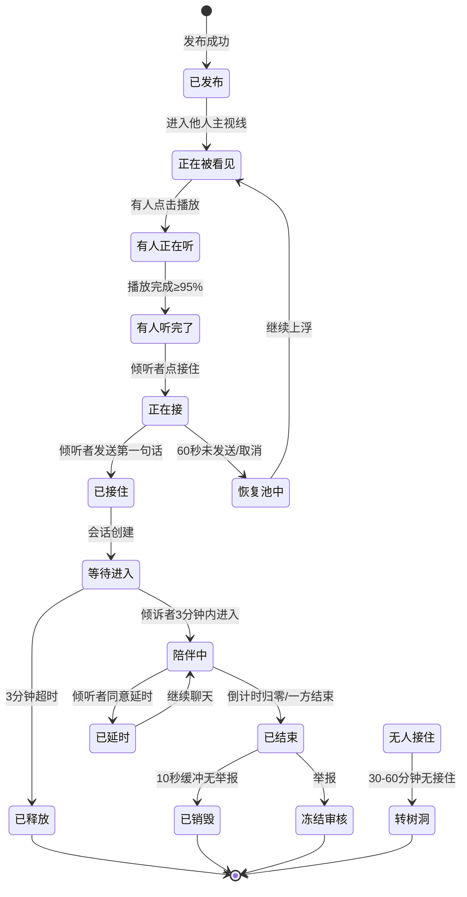
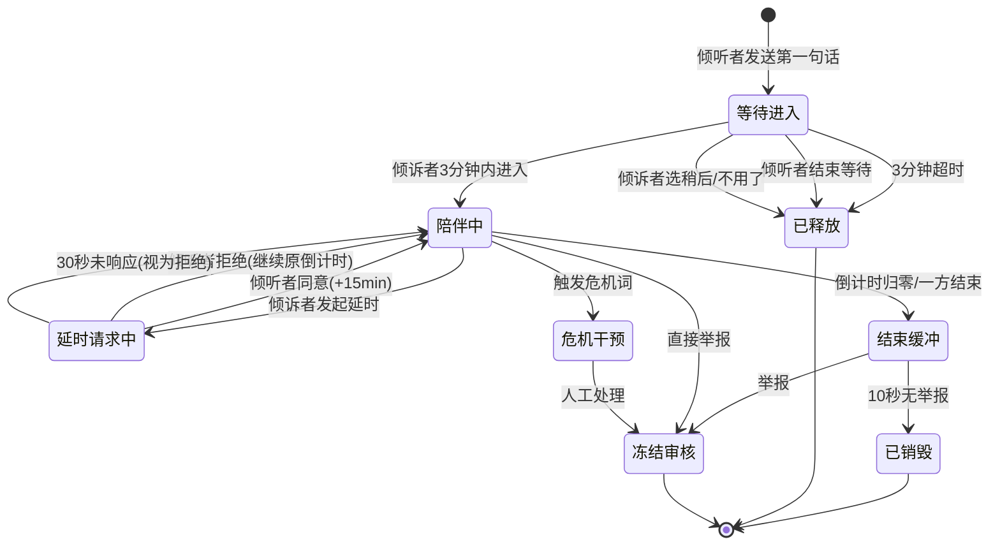
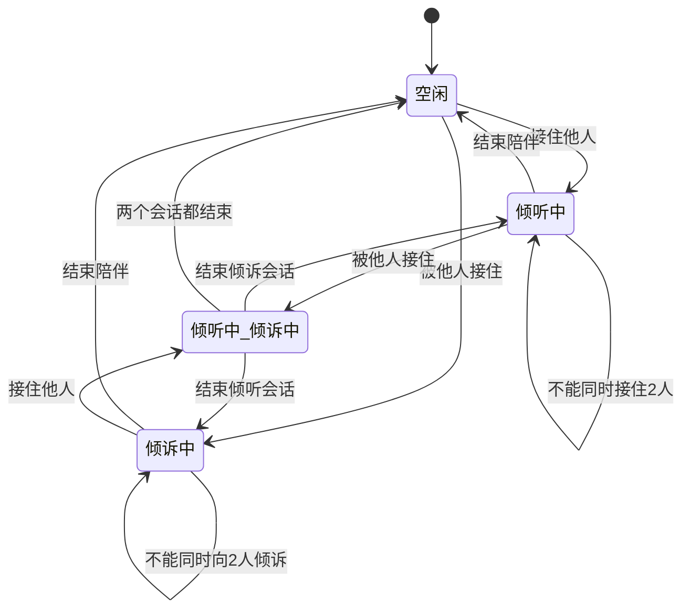
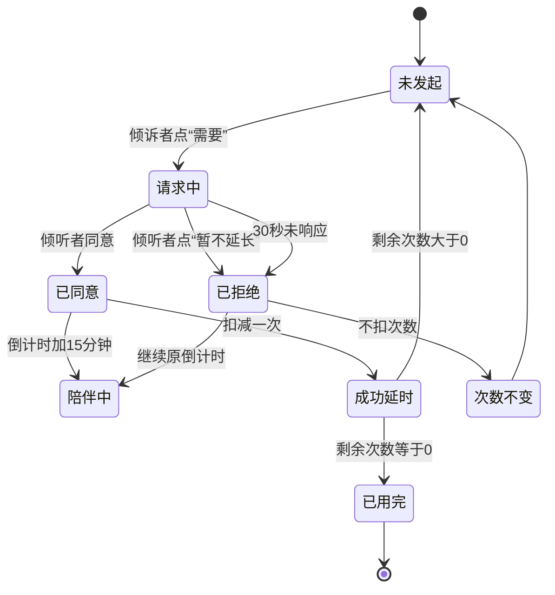
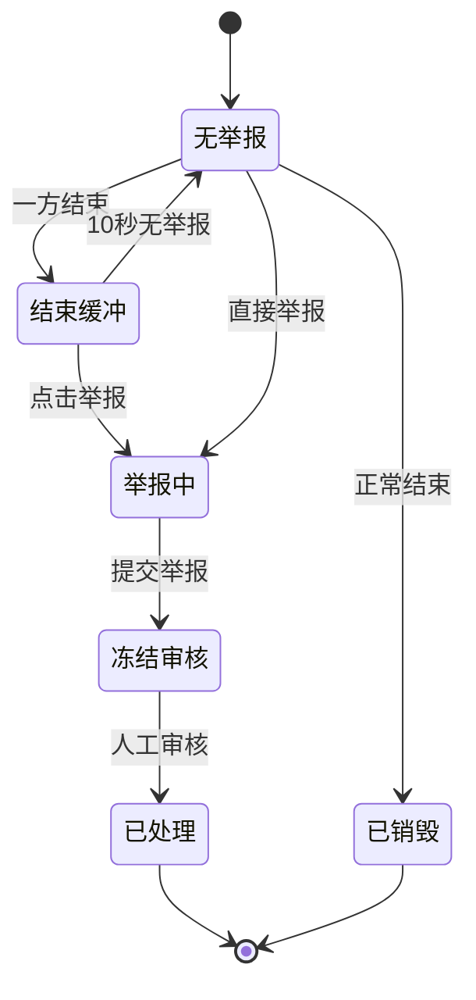

# 即时情绪接住网络 · 完整交付文档

## 一、完整 PRD

### 1. 文档信息

| 项目 | 内容 |
|---|---|
| 产品名称 | 即时情绪接住网络（暂定名：树洞池） |
| 文档版本 | v1.0 |
| 文档状态 | 评审稿 |
| 目标平台 | 微信小程序（MVP），后续扩展 App |
| 目标用户 | 18 岁以上成年人 |
| 首发场景 | 单城市/单高校/单企业试点 |

### 2. 产品概述

#### 2.1 一句话定位
一个即时情绪接住网络：人人可倾诉，人人可倾听；发出信号，愿意的人自然接住；1 分钟内被看到，聊完即散，无关系沉淀。

#### 2.2 产品背景
- 很多人有烦恼，但不想让熟人知道，找不到人倾诉。
- 传统心理咨询门槛高、费用高、预约难。
- 匿名社交容易变味，变成骚扰、约炮、诈骗。
- 现有倾诉平台多为接单模式，有供给方和需求方，关系可沉淀。
- 需要一个临时、双盲、有边界、可监管的情绪陪伴空间。

#### 2.3 产品目标
1. 让倾诉者 1 分钟内被系统接住，60 秒内尽量被真人看到。
2. 让倾听者可以随时在场、自愿接住、随时离开。
3. 聊完即散，无好友、无私信、无主页、无历史。
4. 高危问题转介专业渠道，不替代心理咨询。
5. 反成瘾，追求“被接住一次，然后回到生活”。

#### 2.4 非目标
- 不做匿名社交。
- 不做心理咨询平台。
- 不做接单/抢单/积分/排行榜。
- 不做实时语音房（MVP）。
- 不做好友、私信、主页、动态。
- 不做公开曝光、挂人、审判。

### 3. 用户画像

#### 3.1 倾诉者

| 维度 | 描述 |
|---|---|
| 年龄 | 18—35 岁为主 |
| 场景 | 深夜、考试周、失恋、工作压力、家庭冲突、孤独 |
| 痛点 | 不想让熟人知道、不擅长文字、不想维护关系 |
| 需求 | 被看见、被听到、被接住、聊完即散 |
| 顾虑 | 隐私泄露、被评价、被骚扰、没人理 |

#### 3.2 倾听者

| 维度 | 描述 |
|---|---|
| 年龄 | 18—40 岁为主 |
| 特征 | 有安抚能力、愿意临时听别人说一会儿 |
| 动机 | 被接住过、想帮助别人、获得意义感 |
| 顾虑 | 被耗竭、被骚扰、被无限等待、被道德绑架 |
| 需求 | 随时在场、自愿接住、随时离开、不被惩罚 |

### 4. 功能需求

#### 4.1 功能清单

| 编号 | 模块 | 功能 | 优先级 |
|---|---|---|---|
| F01 | 登录 | 手机号验证、年龄确认、社区公约 | P0 |
| F02 | 全局布局 | 顶部+内容+底部固定 | P0 |
| F03 | 顶部栏 | 返回、标题、消息入口+红点 | P0 |
| F04 | 底部栏 | 树洞池/倾诉/我的 | P0 |
| F05 | 树洞池 | 泡泡上浮、主视线光带、点击播放 | P0 |
| F06 | 倾诉发布 | 文字/语音、标签、模式选择 | P0 |
| F07 | 播放浮窗 | 播放条、接住按钮禁用/启用、关闭 | P0 |
| F08 | 接住 | 正在接、已接住两个状态 | P0 |
| F09 | 等待窗口 | 3 分钟等待倾诉者进入 | P0 |
| F10 | 消息列表 | 倾听 TA 人、倾诉自我两个分组 | P0 |
| F11 | 聊天页 | 文字+变声语音条、倒计时、结束陪伴 | P0 |
| F12 | 延时 | 倾诉者发起、倾听者同意、3次×15分钟 | P0 |
| F13 | 结束缓冲 | 10 秒缓冲期、举报保护 | P0 |
| F14 | 举报 | 播放浮窗、聊天页、缓冲期举报 | P0 |
| F15 | 危机干预 | 关键词识别、热线转介、人工介入 | P0 |
| F16 | 设置 | 隐身、勿扰、屏蔽、隐私、黑名单 | P1 |
| F17 | 我的 | 我的泡泡、状态时间线、举报记录 | P1 |
| F18 | 情绪评分 | 结束后情绪评分、安全评价 | P1 |
| F19 | 变声 | 端侧变声、随机音色、情绪保留 | P0 |
| F20 | 限次 | 倾诉 3 次/日、倾听 5 次/日 | P0 |

#### 4.2 核心流程

倾诉者流程：

```text
登录 → 树洞池首页 → 点倾诉 → 录语音/写文字 → 选标签 → 选模式
→ 发布 → 泡泡升起 → 等待被看见/被听/被接住
→ 收到接住提醒 → 进入临时房 → 聊天 → 延时（可选）
→ 结束缓冲 → 房间销毁 → 回到树洞池
```

倾听者流程：

```text
登录 → 树洞池首页 → 点击泡泡 → 播放语音 → 听完
→ 点接住 → 输入第一句话 → 发送 → 等待倾诉者进入（3分钟）
→ 进入临时房 → 聊天 → 延时请求（可选）→ 结束
→ 回到树洞池
```

### 5. 非功能需求

| 类别 | 需求 |
|---|---|
| 性能 | 首页加载 < 1s，泡泡动画 60fps，消息延迟 < 500ms |
| 可用性 | 99.9% 可用性，危机干预 100% 触发 |
| 安全 | 后台实名、前台匿名、端侧变声、原声不出设备 |
| 合规 | 备案、实名、内容审核、隐私政策、未成年人保护 |
| 隐私 | 聊完即焚、无历史、无好友、加密存储 |
| 无障碍 | 减少动态效果、列表模式、文字转语音 |
| 反成瘾 | 每日限次、不追求停留时长、到时间提示休息 |

### 6. 数据需求

#### 6.1 核心实体

| 实体 | 关键字段 |
|---|---|
| User | id, 手机号hash, 年龄确认, 状态, 封禁标记 |
| AnonymousSession | id, user_id, 临时匿名ID, 过期时间 |
| Signal | id, user_id, 类型, 标签, 模式, 变声音频, 状态, 创建时间 |
| ListenerPresence | id, user_id, 在线状态, 愿意听的标签 |
| TempRoom | id, signal_id, 倾诉者ID, 倾听者ID, 开始时间, 结束时间, 状态 |
| Message | id, room_id, 发送者, 类型, 内容/音频, 时间 |
| DelayRequest | id, room_id, 发起者, 状态, 创建时间 |
| Report | id, 举报人, 被举报人, 房间ID, 原因, 状态 |
| CrisisEvent | id, user_id, 信号/房间ID, 触发词, 处理状态 |

#### 6.2 数据保留

| 数据 | 保留策略 |
|---|---|
| 原声 | 不存 |
| 变声音频 | 房间结束即删 |
| 消息记录 | 房间结束即删 |
| 审核日志 | 合规留存，用户不可见 |
| 举报证据 | 最后20条消息/5分钟音频，合规留存 |

### 7. 验收标准

| 编号 | 验收项 | 标准 |
|---|---|---|
| A01 | 1分钟被看到率 | ≥ 95% |
| A02 | 首次轻响应中位数 | < 30秒 |
| A03 | 真人接住率 | > 40%（试点） |
| A04 | 临时房完成率 | > 60% |
| A05 | 倾诉后情绪改善 | > 30% |
| A06 | 举报率 | < 1% |
| A07 | 危机转介触发率 | 100% |
| A08 | 3分钟等待超时率 | < 20% |
| A09 | 倾听者耗竭率 | < 10% |

---

## 二、高保真交互原型

### 1. 全局布局

```text
┌─────────────────────────────┐
│ ←  标题              💬 ②   │  顶部栏 56pt
├─────────────────────────────┤
│                             │
│                             │
│          内容层              │  自适应
│                             │
│                             │
├─────────────────────────────┤
│  ⌂ 树洞池  ◉ 倾诉  ○ 我的    │  底部栏 64pt
└─────────────────────────────┘
```

- 顶部栏：左返回（二级页），中标题，右消息入口+红点。
- 底部栏：三 tab，中间倾诉为球形凸起按钮。
- 所有页面进入只是内容层更替，顶底常驻。

### 2. 树洞池首页

```text
┌─────────────────────────────┐
│  树洞池              💬 ②   │
├─────────────────────────────┤
│                             │
│          ○                  │
│       ○      ○              │
│    ○            ○           │
│  ───── 主视线光带 ─────      │
│       ○     ○               │
│    ○           ○            │
│          ○                  │
│                             │
│                             │
├─────────────────────────────┤
│  ⌂ 树洞池  ◉ 倾诉  ○ 我的    │
└─────────────────────────────┘
```

交互：
- 泡泡从底部缓缓上浮，速度 20—40px/s。
- 进入主视线光带（中央 20% 区域）→ 高亮 5%，记一次曝光。
- 点击泡泡 → 暂停上浮，浮窗弹出。
- 倾诉者自己的泡泡带状态层，别人看不到。
- 泡泡生命周期 30—60 分钟，过期转树洞。

### 3. 倾诉发布面板

```text
┌─────────────────────────────┐
│  树洞池              💬 ②   │
├─────────────────────────────┤
│  ┌───────────────────────┐  │
│  │  倾诉                  │  │
│  │                       │  │
│  │  [文字]   [语音]        │  │
│  │                       │  │
│  │  标签：                │  │
│  │  [学业][关系][孤独]     │  │
│  │  [焦虑][家庭][其他]     │  │
│  │                       │  │
│  │  模式：                │  │
│  │  ○ 只想被听到           │  │
│  │  ○ 希望有人接住         │  │
│  │                       │  │
│  │  [按住说话 60s]         │  │
│  │                       │  │
│  │  [发布]          [×]   │  │
│  └───────────────────────┘  │
├─────────────────────────────┤
│  ⌂ 树洞池  ◉ 倾诉  ○ 我的    │
└─────────────────────────────┘
```

交互：
- 从底部弹出，半屏，背景变暗。
- 文字/语音切换，语音最长 60s。
- 标签单选，模式单选。
- 发布后泡泡从按钮位置升入池中。
- 不跳页，直接看到自己的泡泡升起。

### 4. 播放浮窗

```text
┌─────────────────────────────┐
│  树洞池              💬 ②   │
├─────────────────────────────┤
│  ┌───────────────────────┐  │
│  │  ▶  ━━━━━━━━━  00:32  │  │
│  │                       │  │
│  │  标签：孤独            │  │
│  │  变声语音 · 60s        │  │
│  │                       │  │
│  │  [接住]（未播完禁用）  │  │
│  │  听完再决定，是否接住TA │  │
│  │                    [×] │  │
│  └───────────────────────┘  │
├─────────────────────────────┤
│  ⌂ 树洞池  ◉ 倾诉  ○ 我的    │
└─────────────────────────────┘
```

交互：
- 点击泡泡 → 浮窗从底部弹出，开始播放。
- 播放条走完 ≥95% → 接住按钮亮起。
- 未播完 → 接住禁用，文案：“听完再决定，是否接住 TA”。
- 关闭 × → 停止播放，泡泡回池。
- 没有跳过按钮。
- 播放中可举报。

### 5. 接住输入面板

```text
┌─────────────────────────────┐
│  ←  接住 TA                 │
├─────────────────────────────┤
│                             │
│  你正在接住 TA              │
│                             │
│  说点什么，让 TA 知道你在    │
│                             │
│  ┌───────────────────────┐  │
│  │ 输入框...              │  │
│  └───────────────────────┘  │
│                             │
│  [🎤 按住说话]              │
│                             │
│  [发送]                     │
│                             │
│  提示：不评判、不诊断、       │
│  不交换联系方式              │
│                             │
│  倒计时：58s                │
├─────────────────────────────┤
│  ⌂ 树洞池  ◉ 倾诉  ○ 我的    │
└─────────────────────────────┘
```

交互：
- 点击接住 → 进入输入面板。
- 可打字或录变声语音。
- 发送按钮在输入内容前禁用。
- 60 秒倒计时，超时自动取消。
- 返回可主动取消，不惩罚。
- 发送后 → 进入等待倾诉者进入窗口。

### 6. 等待倾诉者进入

```text
┌─────────────────────────────┐
│  ←  等待 TA 进入            │
├─────────────────────────────┤
│                             │
│  ┌───────────────────────┐  │
│  │  🫧                   │  │
│  │                       │  │
│  │  已发送，等待 TA 进入  │  │
│  │                       │  │
│  │  倒计时：02:45         │  │
│  │                       │  │
│  │  [结束等待]            │  │
│  └───────────────────────┘  │
│                             │
├─────────────────────────────┤
│  ⌂ 树洞池  ◉ 倾诉  ○ 我的    │
└─────────────────────────────┘
```

交互：
- 3 分钟等待窗口。
- 等待期不计入陪伴时长。
- 倾诉者进入 → 会话激活，倒计时开始。
- 超时 → 自动释放，次数返还。
- 可随时点“结束等待”。

### 7. 消息列表

```text
┌─────────────────────────────┐
│ ←  消息              💬     │
├─────────────────────────────┤
│  ── 倾听 TA 人 ──           │
│  ┌───────────────────────┐  │
│  │ 🫧 匿名倾诉者          │  │
│  │ 标签：孤独             │  │
│  │ 你接住了 TA · 剩 22:14 │  │
│  │                    🔴  │  │
│  └───────────────────────┘  │
│                             │
│  ── 倾诉自我 ──             │
│  ┌───────────────────────┐  │
│  │ 🫧 接住你的人          │  │
│  │ 标签：焦虑             │  │
│  │ TA 接住了你 · 剩 18:40 │  │
│  │                    🔴  │  │
│  └───────────────────────┘  │
├─────────────────────────────┤
│  ⌂ 树洞池  ◉ 倾诉  ○ 我的    │
└─────────────────────────────┘
```

交互：
- 两个分组：倾听 TA 人、倾诉自我。
- 最多各 1 个会话。
- 点击进入聊天页。
- 未读红点。
- 退出聊天页 → 回列表，继续倒计时。
- 结束 → 列表项消失。

### 8. 聊天页

```text
┌─────────────────────────────┐
│ ←  临时陪伴          💬 ②   │
├─────────────────────────────┤
│  剩 22:14                   │
│  TA 接住了你                 │
│  接下来 30 分钟，你们匿名陪伴 │
│  聊完即散，不留记录           │
│  ─────────────────────────  │
│                             │
│  [对方] 你好，我在听。       │
│                             │
│  [我] 谢谢…                 │
│                             │
│  [对方] 🎤 变声语音 00:12    │
│                             │
│                             │
│  ─────────────────────────  │
│  [延时 15 分钟] 剩余：2/3    │
│  [输入框]        [🎤] [发送] │
│  [结束陪伴]                  │
├─────────────────────────────┤
│  ⌂ 树洞池  ◉ 倾诉  ○ 我的    │
└─────────────────────────────┘
```

交互：
- 顶部倒计时。
- 不显示对方昵称，只显示“对方”。
- 文字 + 变声语音条。
- 无已读、在线、输入中状态。
- 底部“结束陪伴”。
- 剩余 3 分钟时出现延时提醒。

### 9. 延时提醒与请求

倾诉者端：

```text
┌─────────────────────────────┐
│  当前会话还剩 02:45          │
│  需要延时 15 分钟吗？        │
│  [ 需要 ]      [ 不需要 ]    │
└─────────────────────────────┘
```

倾听者端：

```text
┌─────────────────────────────┐
│  对方想延长 15 分钟陪伴      │
│  是否同意？                  │
│  [ 同意 ]    [ 暂不延长 ]    │
│  30 秒未选择将视为暂不延长   │
└─────────────────────────────┘
```

交互：
- 倾诉者点“需要” → 发起请求。
- 点“不需要” → 仅关闭提醒，不结束会话。
- 常驻“延时 15 分钟”按钮。
- 倾听者同意 → +15 分钟。
- 倾听者拒绝 → 不延长，会话继续。
- 30 秒未响应 → 视为拒绝，会话继续。

### 10. 结束缓冲期

```text
┌─────────────────────────────┐
│                             │
│  对话将在 10 秒后结束        │
│                             │
│  [举报]      [知道了]        │
│                             │
│  倒计时：10 9 8 7...        │
│                             │
└─────────────────────────────┘
```

交互：
- 禁止发送新消息。
- 举报按钮常驻。
- 点举报 → 倒计时停止，进入举报表单。
- 10 秒无举报 → 正常销毁。

### 11. 举报表单

```text
┌─────────────────────────────┐
│  ←  举报                     │
├─────────────────────────────┤
│                             │
│  选择原因：                  │
│  ○ 骚扰/辱骂                 │
│  ○ 色情内容                  │
│  ○ 诈骗/广告                 │
│  ○ 自伤/自杀                 │
│  ○ 暴力威胁                  │
│  ○ 其他                      │
│                             │
│  补充说明：                  │
│  [输入框]                    │
│                             │
│  [提交举报]                  │
│                             │
├─────────────────────────────┤
│  ⌂ 树洞池  ◉ 倾诉  ○ 我的    │
└─────────────────────────────┘
```

交互：
- 选择原因，可选补充说明。
- 提交后房间冻结，双方退出。
- 保留最后 20 条消息/5 分钟音频供审核。
- 举报方看到“举报已提交”。
- 被举报方看到“对话已结束”。

### 12. 设置页

```text
┌─────────────────────────────┐
│ ←  设置                     │
├─────────────────────────────┤
│                             │
│  隐身浏览              [ ]  │
│  勿扰模式              [ ]  │
│  屏蔽标签              [>]  │
│  通知提醒              [>]  │
│  隐私与安全            [>]  │
│  黑名单                [>]  │
│  社区公约              [>]  │
│  注销账号              [>]  │
│                             │
├─────────────────────────────┤
│  ⌂ 树洞池  ◉ 倾诉  ○ 我的    │
└─────────────────────────────┘
```

### 13. 我的页

```text
┌─────────────────────────────┐
│  我的                       │
├─────────────────────────────┤
│                             │
│  ┌───────────────────────┐  │
│  │  我的泡泡              │  │
│  │                       │  │
│  │  标签：孤独            │  │
│  │  状态：有人听完了      │  │
│  │  时间：今天 23:14      │  │
│  └───────────────────────┘  │
│                             │
│  ┌───────────────────────┐  │
│  │  安全中心              │  │
│  │  举报记录              │  │
│  │  设置                  │  │
│  └───────────────────────┘  │
│                             │
├─────────────────────────────┤
│  ⌂ 树洞池  ◉ 倾诉  ○ 我的    │
└─────────────────────────────┘
```

### 14. 危机干预页

```text
┌─────────────────────────────┐
│  需要帮助吗？                │
├─────────────────────────────┤
│                             │
│  你不需要一个人扛。          │
│                             │
│  [拨打 12356 心理援助热线]   │
│  [拨打 110]                 │
│  [拨打 120]                 │
│                             │
│  [呼吸引导]                 │
│  [安全计划]                 │
│                             │
│  [联系学校心理中心]          │
│                             │
├─────────────────────────────┤
│  ⌂ 树洞池  ◉ 倾诉  ○ 我的    │
└─────────────────────────────┘
```

---

## 三、状态机图

### 1. 泡泡状态机



### 2. 临时房状态机



### 3. 用户角色状态机



### 4. 延时请求状态机



### 5. 举报状态机



---

## 四、技术选型清单

### 1. 前端

| 类别 | 选型 | 理由 |
|---|---|---|
| 小程序框架 | 微信小程序原生 / Taro | 微信生态，冷启动成本低 |
| UI 框架 | Taro UI / Vant Weapp | 组件丰富，适配小程序 |
| 状态管理 | Redux / Zustand | 轻量，适合多会话状态 |
| 动画 | Canvas 2D / WebGL | 泡泡上浮，60fps |
| 音频播放 | 微信 InnerAudioContext | 小程序原生音频 |
| 音频录制 | 微信 RecorderManager | 60秒语音录制 |
| 变声 SDK | 端侧变声 SDK（自研/第三方） | 原声不出设备 |
| 实时通信 | WebSocket | 消息、倒计时、状态推送 |
| 本地存储 | 微信 Storage | 临时状态、匿名 ID |

### 2. 后端

| 类别 | 选型 | 理由 |
|---|---|---|
| 语言 | Go / Node.js | 高并发，实时通信 |
| 框架 | Gin / NestJS | 轻量，易扩展 |
| API 网关 | Kong / APISIX | 限流、鉴权、路由 |
| 用户服务 | 自研 | 实名、匿名、封禁 |
| 信号流服务 | 自研 | 泡泡发布、曝光、状态 |
| 匹配服务 | 自研 | 广播、在线池、标签匹配 |
| 房间服务 | 自研 | 临时房、倒计时、延时 |
| 消息服务 | 自研 | 文字、变声语音条 |
| 审核服务 | 自研 + 第三方 | ASR、关键词、人工复审 |
| 危机干预 | 自研 | 关键词、热线、人工 |
| 举报服务 | 自研 | 举报、冻结、证据保留 |
| 推送服务 | 微信订阅消息 / APNs | 接住提醒、等待提醒 |

### 3. 数据存储

| 类别 | 选型 | 理由 |
|---|---|---|
| 关系型数据库 | PostgreSQL / MySQL | 用户、房间、举报 |
| 缓存 | Redis | 在线池、倒计时、会话状态 |
| 消息队列 | Kafka / RabbitMQ | 异步审核、推送、日志 |
| 对象存储 | 腾讯云 COS / 阿里云 OSS | 变声音频临时存储 |
| 搜索 | Elasticsearch（可选） | 举报审核、日志检索 |
| 时序数据库 | InfluxDB（可选） | 指标监控 |

### 4. AI 与音频

| 类别 | 选型 | 理由 |
|---|---|---|
| ASR | 腾讯云 ASR / 阿里云 ASR | 语音转文字，风险识别 |
| 变声 | 端侧变声 SDK | 原声不出设备，隐私保护 |
| 情绪识别 | 自研 / 第三方 | 情绪分类，标签推荐 |
| 危机识别 | 关键词 + 语义模型 | 自伤、自杀、霸凌、暴力 |
| 内容审核 | 腾讯云内容安全 / 阿里云绿网 | 文字、音频审核 |
| 文字转语音 | 腾讯云 TTS | 无障碍支持 |

### 5. 基础设施

| 类别 | 选型 | 理由 |
|---|---|---|
| 云服务 | 腾讯云 / 阿里云 | 国内合规，生态完善 |
| 容器 | Docker + Kubernetes | 弹性伸缩 |
| 服务网格 | Istio（可选） | 微服务治理 |
| CI/CD | GitLab CI / Jenkins | 自动化部署 |
| 监控 | Prometheus + Grafana | 指标监控 |
| 日志 | ELK / Loki | 日志收集 |
| 告警 | Alertmanager / 企业微信 | 危机、故障告警 |
| 链路追踪 | Jaeger / SkyWalking | 性能分析 |

### 6. 安全与合规

| 类别 | 选型 | 理由 |
|---|---|---|
| 实名认证 | 手机号 + 运营商 | 后台实名 |
| 加密 | TLS + AES-256 | 传输、存储加密 |
| 隐私合规 | 隐私政策 + 用户协议 | 合规 |
| 未成年人保护 | 年龄确认 + 青少年模式 | 合规 |
| 内容审核 | 机器 + 人工 | 合规 |
| 数据留存 | 合规留存 + 用户不可见 | 合规 |
| 备案 | ICP + 公安备案 | 合规 |

### 7. 第三方服务

| 类别 | 选型 | 理由 |
|---|---|---|
| 心理热线 | 12356 | 危机转介 |
| 紧急救助 | 110 / 120 | 危机转介 |
| 青少年服务 | 12355 | 校园版转介 |
| 心理机构 | 合作机构 | 危机兜底 |
| 公益组织 | 合作组织 | 倾听者供给 |

### 8. 团队配置建议

| 角色 | 人数 | 职责 |
|---|---|---|
| 产品经理 | 1 | 需求、PRD、迭代 |
| UI/UX | 1 | 原型、视觉、交互 |
| 前端 | 2 | 小程序、动画、音频 |
| 后端 | 2 | 服务、匹配、房间 |
| AI/音频 | 1 | 变声、ASR、审核 |
| 安全/审核 | 1 | 举报、危机、合规 |
| 运营 | 1 | 冷启动、倾听者培训 |
| 心理顾问 | 1 | 危机干预、伦理 |

---

## 五、总结

核心设计：

树洞池泡泡上浮，倾诉者自己的泡泡显示状态，别人看不到。一个用户最多一个倾听和一个倾诉会话。接住分正在接和已接住。3 分钟等待窗口。延时 15 分钟×3 次，倾听者同意才生效。结束前 10 秒缓冲期可举报。聊完即散，无好友、无私信、无历史。